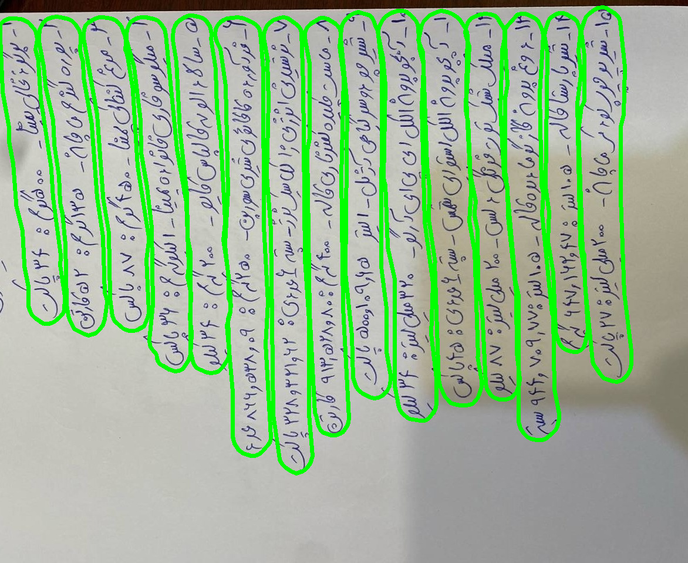
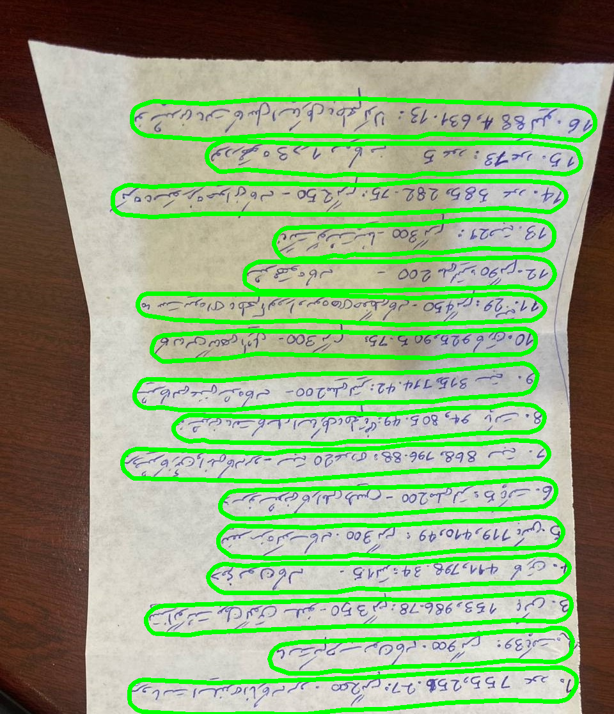
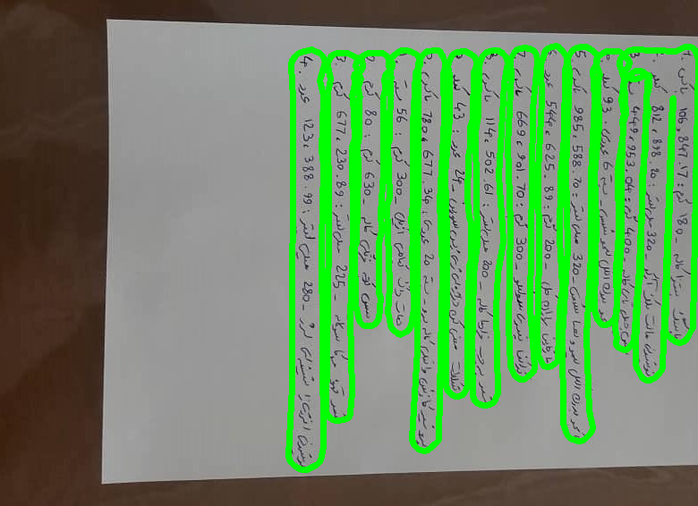
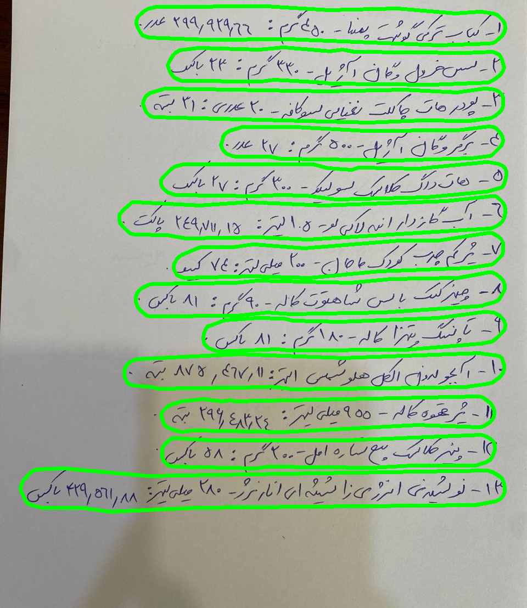

Handwritten Text Detection with DBNet

This repository contains a fine-tuned version of DBNet (Differentiable Binarization Network) for handwritten text detection.
The model is based on the original implementation and trained on custom handwritten text data.

🔗 Original DBNet repository:
[https://github.com/WenmuZhou/DBNet.pytorch](https://github.com/WenmuZhou/DBNet.pytorch)

✨ Features

Fine-tuned DBNet for handwritten text detection

Supports curved, irregular, and dense handwriting

Robust to rotation

Polygon-based text detection

Fast inference suitable for real-world applications

Compatible with custom datasets and annotations

🧠 Model Overview

DBNet formulates text detection as a segmentation task and introduces a differentiable binarization module that allows the network to learn optimal thresholds automatically.

This fine-tuned version improves performance on:

Handwritten documents

Notes, forms, and scanned pages

Irregular text layouts

📂 Repository Structure
```bash
├── utils/                 
├── net/                   
├── Dataset/
│   ├── images/           
│   ├── labels/            
├── weights/               
└── README.md
```

📦 Installation
1️⃣ Clone the repository

```bash
git clone [https://github.com/your-username/handwritten-dbnet.git](https://github.com/imaryamsamani-lang/Text-Recognition.git)
cd handwritten-dbnet
```

2️⃣ Create environment & install dependencies

```bash
conda create -n dbnet python=3.8 -y
conda activate dbnet
pip install -r requirements.txt
```

⚠️ Make sure you have PyTorch installed with CUDA support if using a GPU.

📊 Dataset Format

The model is trained using polygon-level annotations.

Each image has a corresponding annotation file containing text polygons:

```text
{
  "polygons": [
    [[x1, y1], [x2, y2], [x3, y3], [x4, y4]],
    ...
  ]
}
```

Supported:

Multiple text instances per image

Arbitrary polygon shapes

Curved handwriting

🚀 Training

Follow the steps in CV_DBNet.ipynb

Key training options:

Backbone: ResNet-18 / ResNet-50

Image size: configurable

Optimizer: Adam

Loss: DB Loss (probability + threshold maps)

📈 Evaluation

Metrics:

Precision: 0.99

Recall: 0.73

F-score: 0.84

IoU

🖼️ Inference

Download the weights at: https://drive.google.com/file/d/1GWDVhdM54axJXbb-Buommhr3FlpDecPL/view?usp=sharing

Run detection on a single image or a folder:

🔍 Example Results
Input	Output
Handwritten page	Detected text regions






🧪 Fine-Tuning Notes

To adapt DBNet for handwriting:

Lowered binarization threshold sensitivity

Augmented training with rotation, blur, and noise

Tuned shrink ratio for thin strokes


Open-source OCR research community
